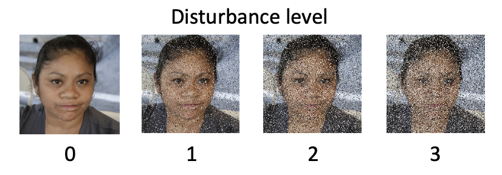

# [Fréchet AutoEncoder Distance: A new approach for evaluation of Generative Adversarial Networks](https://doi.org/10.1016/j.cviu.2023.103768)

<div align="center">
  <a target="_blank">Lucas F. Buzuti</a> &emsp; <b>&middot;</b> &emsp;
  <a href="https://fei.edu.br/~cet/" target="_blank">Carlos E. Thomaz</a> 
</div>
<br>
<br>

[Fréchet AutoEncoder Distance (FAED)](https://doi.org/10.1016/j.cviu.2023.103768) is a new approach for evaluation of generative models. FAED uses a deep unsupervised model to estimate the mean and the covariance matrix of the Fréchet Distance.

## Requirements
+ Linux and Windows are supported, but this repository has been carried out on Linux. So,  we recommend Linux for performance and compatibility reasons.
+ We have done all testing and development using 2 NVIDIA Tesla V100 GPUs 16Gb.
+ 64-bit Python 3.7 and PyTorch 1.8.1. See https://pytorch.org/ for PyTorch install instructions. 
+ Python libraries: `pip install click requests tqdm pyspng ninja imageio-ffmpeg==0.4.3`. We use the Anaconda3 2020.11 distribution which installs most of these by default.

## Set up datasets
Through `dataset_preparation.py` the data are prepared for training VQ-VAE, DCGAN, and WGAN-GP. Run `python dataset_preparation.py --help` for more information.

<details><summary>ImageNet</summary>

This dataset should be downloaded manually at https://gist.github.com/antoinebrl/7d00d5cb6c95ef194c737392ef7e476a. Then run `python dataset_preparation.py --path=~/dataset/ImageNet --resize=128 --dataset=imagenet --outdir=~/where/dataset/will/be/saved`.
</details>

<details><summary>Flickr Faces HQ</summary>

This dataset should be downloaded manually at https://github.com/NVlabs/ffhq-dataset. Then run `python dataset_preparation.py --path=~/dataset/Flickr --resize=128 --dataset=ffhq`.
</details>

<details><summary>CelebA</summary>

This dataset should be downloaded manually at https://mmlab.ie.cuhk.edu.hk/projects/CelebA.html. Then run `python dataset_preparation.py --path=~/dataset/CelebA --resize=128 --dataset=celeba`.
</details>

<details><summary>Animal Faces HQ</summary>

This dataset should be downloaded manually at https://github.com/clovaai/stargan-v2. Then run `python dataset_preparation.py --path=~/datasets/AFHQ --resize=128 --dataset=afhq`.
</details>

## Running the training scripts
### VQ-VAE training
Unsupervised model training to estimate the mean and the covariance matrix of the Fréchet Distance. For this training, we use the ImageNet dataset. Run `python train.py --help` for more information.

<details><summary>ImageNet</summary>

```shell
export DATA_DIR=PATH_TO_DATA_DIR
export CHECKPOINT_DIR=PATH_TO_CHECKPOINT_DIR
export CODE_DIR=PATH_TO_CODE_DIR
cd $CODE_DIR

python train.py --outdir=$CHECKPOINT_DIR --data=$DATA_DIR/imagenet --gpus=2 --batch=128 --kimg=1300 --snap=10 --model=vq_vae
```
</details>

### DCGAN and WGAN-GP training
For this training, we use FFHQ, CelebA, and AFHQ datasets. Run `python train.py --help` for more information.

<details><summary>Flickr Faces HQ</summary>

Two 16-GB V100 GPUs are used for training Vanilla GAN and WGAN-GP on FFHQ 128px.

**DCGAN**
```shell
export DATA_DIR=PATH_TO_DATA_DIR
export CHECKPOINT_DIR=PATH_TO_CHECKPOINT_DIR
export CODE_DIR=PATH_TO_CODE_DIR
cd $CODE_DIR

python train.py --outdir=$CHECKPOINT_DIR --data=$DATA_DIR/ffhq --gpus=2 --batch=128 --kimg=1024 --snap=1 --metrics=faed50k_full,fid50k_full --model=dcgan
```
**WGAN-GP**
```shell
export DATA_DIR=PATH_TO_DATA_DIR
export CHECKPOINT_DIR=PATH_TO_CHECKPOINT_DIR
export CODE_DIR=PATH_TO_CODE_DIR
cd $CODE_DIR

python train.py --outdir=$CHECKPOINT_DIR --data=$DATA_DIR/ffhq --gpus=2 --batch=128 --kimg=1024 --snap=1 --metrics=faed50k_full,fid50k_full --model=wgan_gp
```
</details>

<details><summary>CelebA</summary>

Two 16-GB V100 GPUs are used for training Vanilla GAN and WGAN-GP on CelebA 128px.

**DCGAN**
```shell
export DATA_DIR=PATH_TO_DATA_DIR
export CHECKPOINT_DIR=PATH_TO_CHECKPOINT_DIR
export CODE_DIR=PATH_TO_CODE_DIR
cd $CODE_DIR

python train.py --outdir=$CHECKPOINT_DIR --data=$DATA_DIR/celeba --gpus=2 --batch=128 --kimg=1024 --snap=1 --metrics=faed50k_full,fid50k_full --model=dcgan
```
**WGAN-GP**
```shell
export DATA_DIR=PATH_TO_DATA_DIR
export CHECKPOINT_DIR=PATH_TO_CHECKPOINT_DIR
export CODE_DIR=PATH_TO_CODE_DIR
cd $CODE_DIR

python train.py --outdir=$CHECKPOINT_DIR --data=$DATA_DIR/celeba --gpus=2 --batch=128 --kimg=1024 --snap=1 --metrics=faed50k_full,fid50k_full --model=wgan_gp
```
</details>

<details><summary>Animal Faces HQ</summary>

Two 16-GB V100 GPUs are used for training Vanilla GAN and WGAN-GP on AFHQ 128px.

**DCGAN**
```shell
export DATA_DIR=PATH_TO_DATA_DIR
export CHECKPOINT_DIR=PATH_TO_CHECKPOINT_DIR
export CODE_DIR=PATH_TO_CODE_DIR
cd $CODE_DIR

python train.py --outdir=$CHECKPOINT_DIR --data=$DATA_DIR/afhq --gpus=2 --batch=128 --kimg=2048 --snap=1 --metrics=faed50k_full,fid50k_full --model=dcgan
```
**WGAN-GP**
```shell
export DATA_DIR=PATH_TO_DATA_DIR
export CHECKPOINT_DIR=PATH_TO_CHECKPOINT_DIR
export CODE_DIR=PATH_TO_CODE_DIR
cd $CODE_DIR

python train.py --outdir=$CHECKPOINT_DIR --data=$DATA_DIR/afhq --gpus=2 --batch=128 --kimg=2048 --snap=1 --metrics=faed50k_full,fid50k_full --model=wgan_gp
```
</details>

## Running the FAED and FID on their images
After metrics computing JSON file is saved with results. Run `python calc_metrics.py --help` for more information.

```shell
export DATA_DIR=PATH_TO_DATA_DIR
export SYNTHETIC=PATH_TO_SYNTHETIC_DATA_DIR
export CODE_DIR=PATH_TO_CODE_DIR
cd $CODE_DIR

python calc_metrics.py --data=$DATA --synthetic=$SYNTHETIC --gpus=2 --metrics=faed50k_full,fid50k_full --verbose=True
```
We recommend calculating the metrics with 50,000 synthetic images.

## Disturbance on the datasets

<details><summary>Gaussian noise</summary>

<p align="center">
    
</p>

```shell
export DATA_DIR=PATH_TO_DATA_DIR
export SAVE_DISTURBANCE_DATASET=PATH_TO_SAVE_DISTURBANCE_DATASET
export CODE_DIR=PATH_TO_CODE_DIR
cd $CODE_DIR

python python dataset_preparation.py --outdir=$SAVE_DISTURBANCE_DATASET --path=$DATA_DIRr --disturb=gnoise
```
</details>

<details><summary>Gaussian blur</summary>

<p align="center">
    
</p>

```shell
export DATA_DIR=PATH_TO_DATA_DIR
export SAVE_DISTURBANCE_DATASET=PATH_TO_SAVE_DISTURBANCE_DATASET
export CODE_DIR=PATH_TO_CODE_DIR
cd $CODE_DIR

python python dataset_preparation.py --outdir=$SAVE_DISTURBANCE_DATASET --path=$DATA_DIRr --disturb=gblur
```
</details>

<details><summary>Black rectangles</summary>

<p align="center">
    
</p>

```shell
export DATA_DIR=PATH_TO_DATA_DIR
export SAVE_DISTURBANCE_DATASET=PATH_TO_SAVE_DISTURBANCE_DATASET
export CODE_DIR=PATH_TO_CODE_DIR
cd $CODE_DIR

python python dataset_preparation.py --outdir=$SAVE_DISTURBANCE_DATASET --path=$DATA_DIRr --disturb=brectangles
```
</details>

<details><summary>Swirl</summary>

<p align="center">
    
</p>

```shell
export DATA_DIR=PATH_TO_DATA_DIR
export SAVE_DISTURBANCE_DATASET=PATH_TO_SAVE_DISTURBANCE_DATASET
export CODE_DIR=PATH_TO_CODE_DIR
cd $CODE_DIR

python python dataset_preparation.py --outdir=$SAVE_DISTURBANCE_DATASET --path=$DATA_DIRr --disturb=swirl
```
</details>

<details><summary>Salt and pepper noise</summary>

<p align="center">
    
</p>

```shell
export DATA_DIR=PATH_TO_DATA_DIR
export SAVE_DISTURBANCE_DATASET=PATH_TO_SAVE_DISTURBANCE_DATASET
export CODE_DIR=PATH_TO_CODE_DIR
cd $CODE_DIR

python python dataset_preparation.py --outdir=$SAVE_DISTURBANCE_DATASET --path=$DATA_DIRr --disturb=spnoise
```
</details>

<details><summary>Shelter</summary>

<p align="center">
    
</p>

```shell
export DATA_DIR=PATH_TO_DATA_DIR
export SAVE_DISTURBANCE_DATASET=PATH_TO_SAVE_DISTURBANCE_DATASET
export CODE_DIR=PATH_TO_CODE_DIR
cd $CODE_DIR

python python dataset_preparation.py --outdir=$SAVE_DISTURBANCE_DATASET --path=$DATA_DIRr --disturb=shelter
```
</details>

<details><summary>Exchange</summary>

<p align="center">
    
</p>

```shell
export DATA_DIR=PATH_TO_DATA_DIR
export SAVE_DISTURBANCE_DATASET=PATH_TO_SAVE_DISTURBANCE_DATASET
export CODE_DIR=PATH_TO_CODE_DIR
cd $CODE_DIR

python python dataset_preparation.py --outdir=$SAVE_DISTURBANCE_DATASET --path=$DATA_DIRr --disturb=exchange
```
</details>

<details><summary>ImageNet contamination</summary>

<p align="center">
    
</p>

```shell
export DATA_DIR=PATH_TO_DATA_DIR
export DATA_CONT_DIR=PATH_TO_DATA_CONTAMINATION_DIR
export SAVE_DISTURBANCE_DATASET=PATH_TO_SAVE_DISTURBANCE_DATASET
export CODE_DIR=PATH_TO_CODE_DIR
cd $CODE_DIR

python dataset_preparation.py --outdir=$SAVE_DISTURBANCE_DATASET --path=$DATA_DIR --pathc=$DATA_CONT_DIR/imagenet --disturb=imagenet-contamination
```
</details>

## Citation
```
@article{buzuti2023frechet,
  title={Fr{\'e}chet AutoEncoder Distance: A new approach for evaluation of Generative Adversarial Networks},
  author={Buzuti, Lucas F and Thomaz, Carlos E},
  journal={Computer Vision and Image Understanding},
  pages={103768},
  year={2023},
  publisher={Elsevier}
}
```
